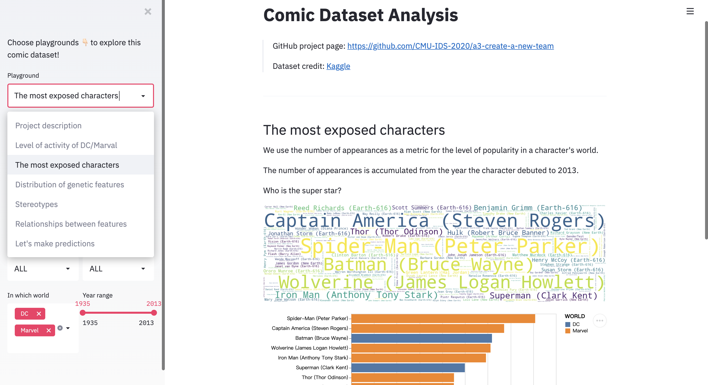

# Comic Character Analysis

The [Comic-Characters dataset](https://www.kaggle.com/fivethirtyeight/fivethirtyeight-comic-characters-dataset) records the characters in DC and Marvel world, coupled with their features, including genetic features (e.g. hair color, eye color, sex), identities, alignments (good characters, bad characters, or neutral characters), the number of appearances, the debut month, etc.. 

We group `EYE`, `HAIR`, `SEX`, `GSM` as genetic features for the sake of convenience, though we are aware that it is controversial whether sexual orientation is genetic. We believe these genetic features are good indicators of one's inborn cultural identities.
Also, we group `ID` and `ALIGN` as acquired identities.

We are interested in the following problems:
- Who are the most exposed characters over the years in DC/Marvel world?
- Are there biases of inborn cultural identities (represented by genetic features) in the distribution of comic characters, and how does these biases change over time? 
- Are there correlations between different genetic features?
<!--TODO: Short abstract describing the main goals and how you achieved them.--->

## Project Goals

- Who are the most exposed characters over the years in DC/Marvel world?
    - We use the number of appearances as a metric for the level of popularity in a character's world.
- Are there biases of inborn cultural identities (represented by genetic features) in the distribution of comic characters, and how does these biases change over time? Are there correlations between different genetic features?
    - We not only examine the bias of a certain genetic feature in character distribution, but also examine the Cartesian products of sets of genetic features, as combinations of genetic features are a better indication of the character's inborn cultural identity (e.g. white men, asian women, etc.).
    - We further examine inborn-cultural-identity-wise biases in different `ID` or `ALIGN` groups, to see `ID` or `ALIGN` correlates with the biases, as well as the relations between different genetic features. We do this by calculating the correlations between these categorical variables. Alternatively, we also take a machine learning approach and represent the asymmetric correlations between features by the Gini importance of a decision tree classifier fitted on the data.

<!--TODO: **A clear description of the goals of your project.** Describe the question that you are enabling a user to answer. The question should be compelling and the solution should be focused on helping users achieve their goals. --->

## Design

<!--TODO: **A rationale for your design decisions.** How did you choose your particular visual encodings and interaction techniques? What alternatives did you consider and how did you arrive at your ultimate choices?--->
### Playground A: Level of activity of DC/Marvel
#### Motivation
To compare the level of activity of the two worlds with respect to year, we consider both the number of characters that debut in that year, and the number of appearances of these characters. In that way, we actually measure the importance of each year (in terms of the characters that debuted in that year) to the comic worlds, because the number of appearances is accumulated from the year the character debuted to the time the dataset is collected.

#### Design Elements
- visual encodings
    - `x`: the debut year of a character
    - `y`: the sum of the number of appearances of characters
    - `color`: DC/Marvel
- considerations of design 
    - line chart, which emphasizes the trend over years
- alternatives
    - bar charts, which is not a good fit for the `year` axis

### Playground B: The most exposed characters
#### Motivation
Visualize the characters that are most exposed. The figures can be filtered by various combinations of features, so that the users can examine the most exposed characters in different groups, for example, good characters, bad female characters, transgender characters with brown eyes.

#### Design Elements
##### word cloud
- visual encodings
    - `size` of the character name: the number of appearances of that character
- alternatives
    - scattered bubble plot (available in Tableau)
        - takes up more space than word cloud for visualizing character names
        - not available in many libraries including Altair and plotly

##### bar plot
- visual encodings
    - `y`: character names
    - `x`: the number of appearances of that character
    - `color`: the world that the character belongs to
- considerations of design
    - bar chart, which deals with one categorical variable and one numerical variable.

### Playground C: Distribution of genetic features
#### Motivation
Genetic features represent inborn cultural identity of a character. We aim to investigate the distribution of inborn cultural identities in the comic worlds. Note that this playground investigates distribution of a single genetic feature and does not consider the popularity of the characters (e.g. the number of appearances).

#### Design Elements

##### stacked bar plot
- visual encodings
    - `x`: the debut year
    - `y`: the number of characters
    - `color`: the selected `Target genetic feature` (chosen from {`EYE`, `HAIR`, `SEX`, `GSM`})
- selector
    - `y`: range (year range)
- considerations of design
    - gives a rough impression of the target genetic feature distribution within each year
    - year-range sliding window allows for a clearer summary of the distribution within a particular time span.

##### bar plot
- the input data is filtered by the selector of the previous stacked bar plot
- visual encodings
    - `y`: the selected `Target genetic feature`
    - `x`: the percentage of characters
- considerations of design
    - we present the percentage of characters rather than the number of characters because we are more interesed in the distribution
    - with sliding window in the previous chart, the change in distribution over time is visually clear

#### Demo

Eye Distribution of the DC World

Eye Distribution of the Marvel World

### Playground D: Stereotypes
#### Motivation
As mentioned, the combination of genetic features might be a better indication of inborn cultural identities than a single genetic feature. For example, {blond hair, blue eye} and {brown hair, brown eye} are respectively the characteristics of two ethnicities.

Here we would like to visualize the stereotypes of comic world characters. And unlike in the previous section, we take into account the number of appearances of each character. 

In particular, we take the logarithm of the number of appearances as a metric for the character's popularity. And the popularity of one possible value $\omega$ of the Cartisan product of a certain set of genetic features ($\Omega$) is defined as the sum of the popularity of all the characters whose $\Omega$ take on the value $\omega$. For example one possible $\omega$ for $\Omega$ being {`HAIR`, `SEX`} is {black_hair, male}.

#### Design Elements
##### word cloud
- visual encodings
    - `size`: popularity of $\omega$
##### bar plot
- visual encodings
    - `y`: $\omega$
    - `x`: popularity of $\omega$
    - `color`: world
- considerations of design
    - we separate the two worlds for a clear comparison
    - sort the bar plot by popularity of both worlds

### Playground E: Relationships between features
#### Motivation
We would like to quantify the correlations between different features. In particular, intra-correlations (correlations between genetic features) and inter-correlations (correlation between a genetic feature and an acquired identity,`ID` (or `ALIGN`)). The former indicates inborn cultural identities.

The correlation is calculated by corrected Cramer\'s V, and it is a symmetric metric.

#### Design Elements
- the upper panel demonstrates intra-correlations, and the lower panel demonstrates inter-correlations
- the left panel demonstrates the DC world, and the right panel demonstrates the Marvel world
- heatmap is a well-received chart type for correlation visualization

### Playground F: Let's make predictions
#### Motivation
Cramer's V is a symmetric metric. But we also want to quantify the impact of one feature upon another feature. So, we translate the problem as `can we predict a genetic feature given the other features, and in our prediction process, what are the contributions of these individual factors?` 

Therefore, we train a decision tree classifier for each of the response variable from {`SEX`, `EYE`, `HAIR`}, and visualize the Gini importance of the explanatory features, as an interpretation of asymmetric correlations. The details of Gini importance are give in [the scikit-learn document](https://scikit-learn.org/stable/modules/generated/sklearn.tree.DecisionTreeClassifier.html?highlight=decision%20tree#sklearn.tree.DecisionTreeClassifier).

#### Design Elements
- visual encodings
    - `y`: explanatory variables
    - `x`: Gini importance
- considerations of design
    - the Gini importance is already normalized, so a vanila bar chart would suffice

## Development

<!--TODO: **An overview of your development process.** Describe how the work was split among the team members. Include a commentary on the development process, including answers to the following questions: Roughly how much time did you spend developing your application (in people-hours)? What aspects took the most time?--->

This project is constructed by `member A`, Jiayi Weng (jiayiwen) and `member B`, Xinyue Chen (xinyuech).

Most critical decisions are made on the agreement of both members. Some of the difficulties that are encountered in the development process are discussed and worked out together, including initial data preprocessing (wrong records in the data source file, merging values in `SEX` and `GSM`), replace bubble plots (unavailable in Altair) with word cloud, choice of correlation metric.

### EDA and Initial Design
Dataset selection is done by `member B`, which takes around 2 hours. 

EDA and the initial design, which is summarized in `design.md`, is done by `member B` and it takes around 3 hours.

### Implementation

In the first round, the layout and initial narrative of this project is designed by `member A` and the implementations of Playground A-D are mostly done by `member A`, which takes around (#TODO) hours. The implementations of Playground E-F are mostly done by `member B`, which takes around 4 hours.

In the second round, both members iteratively enhance the layout, chart types, interactions, visual encodings and narratives for expressiveness of visualizations. This takes around 5 hours.

### Narratives and Writeup

Most of the writeup is done by `member B`, which takes around 6 hours, together with the narratives. Narratives are the result of the discussion of both members. Initial narratives are done by `member A`, and final narratives are done by `Member B`. 

> As, most of the work are interleaved, the above hours of work are only a rough estimation of the workload.
> Thank WYY and CJW (friends of `member B`) for their thoughtful discussions about `GSM` and `SEX`.
